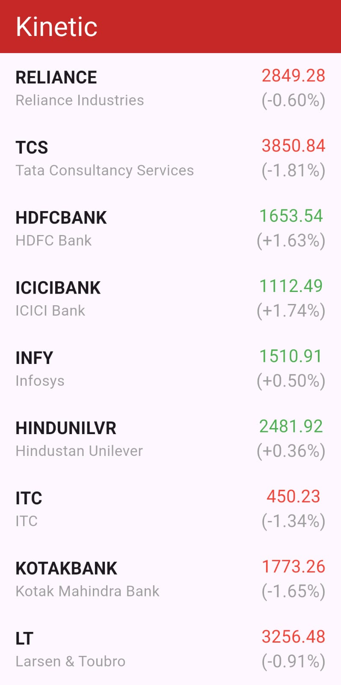
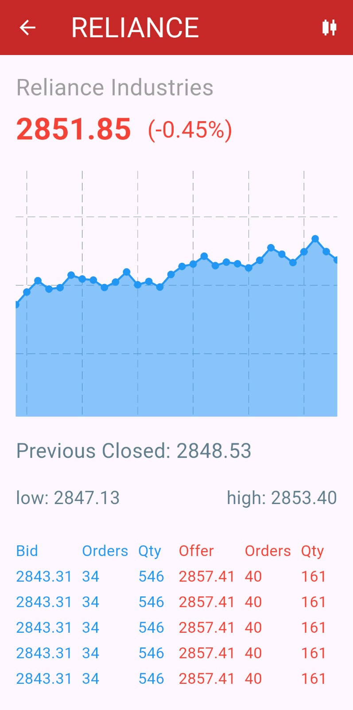
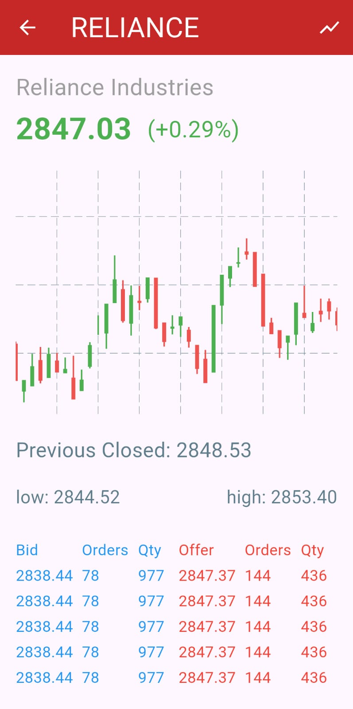
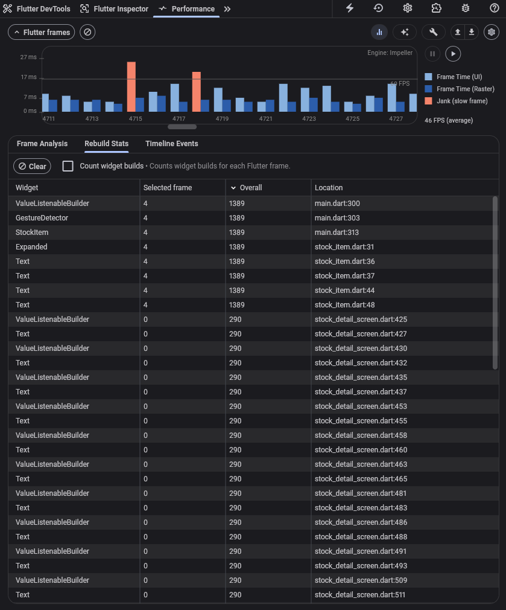
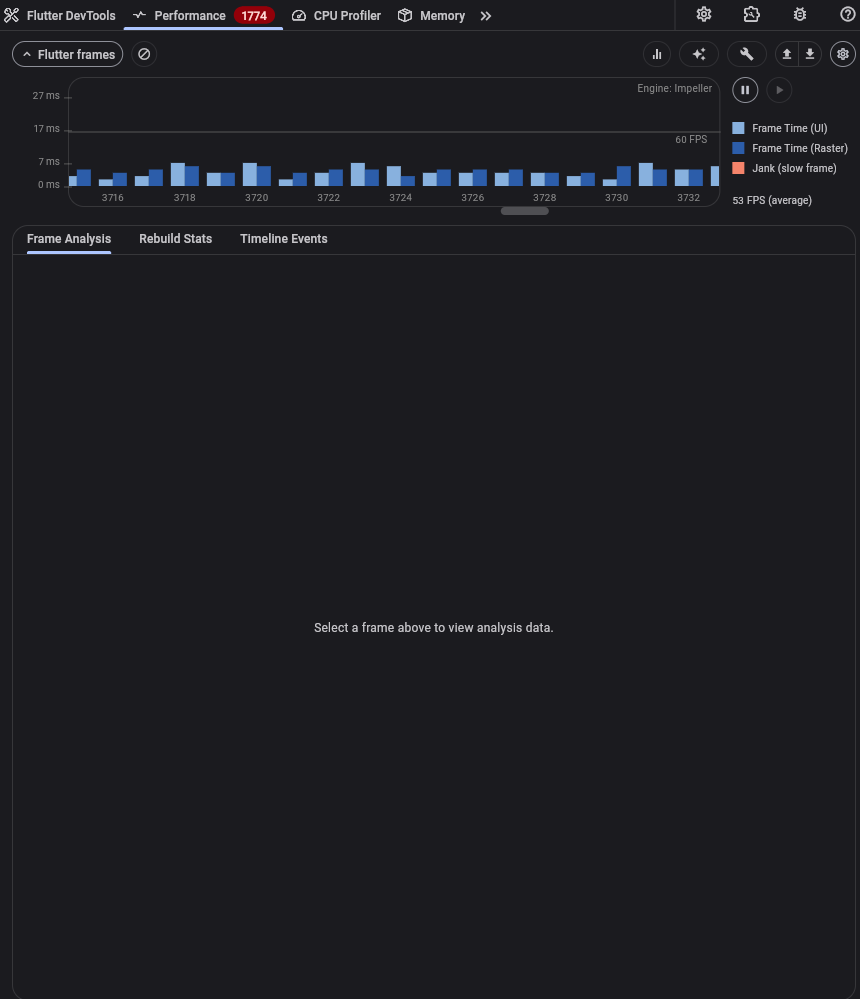

# Kinetic

A Flutter stock ticker demo exploring the architecture behind
[Zerodha](https://zerodha.tech) — India's largest stock broker —
and why they rewrote their platform in Flutter.

<p align="center">
  <a href="LICENSE">
    
  </a>
</p>

<p align="center">
  
</p>

## Why Flutter?

Zerodha went from Native Android → React Native → Flutter.
[Their blog](https://zerodha.tech/blog/from-native-to-react-native-to-flutter/) explains why:

> When 50+ stocks update multiple times per second, you can't rebuild
> the entire UI. Each widget must rebuild independently.

React Native can achieve granular rebuilds, but Zerodha found the
JS-Native bridge latency and setState batching made it unreliable
for high-frequency financial data. Flutter's direct canvas rendering
and ValueNotifier made the same pattern simpler and more performant.

This demo implements that pattern with zero third-party state management.

## Demo

<p align="center">
  
</p>

## Features

- 50 Nifty 50 stocks with simulated real-time price updates
- Line chart and candlestick chart with toggle
- Interactive zoom and pan
- Simulated order book (bid/offer depth)
- Session high/low tracking
- Granular widget rebuilds

<p align="center">
  
  
</p>

## Architecture

```dart
// Each stock gets its own notifier
stockNotifiers = _stocks.map((s) => ValueNotifier(s)).toList();

// Only this row rebuilds when this stock changes
ValueListenableBuilder<Stock>(
  valueListenable: notifier,
  builder: (context, stock, _) => StockItem(...),
)
```

50 stocks updating every 10-20ms. Only the changed row rebuilds.

## Performance

<p align="center">
  
</p>

<p align="center">
  
</p>

| Mode | FPS | Notes |
|------|-----|-------|
| Debug | ~46 | Expected overhead from debug tooling |
| Profile | 55-60 | Baseline for production optimization |

## Project Structure

```
lib/
├── main.dart                    # Home screen, price simulation engine
├── models/
│   └── stock.dart               # Stock data class
├── screens/
│   └── stock_detail_screen.dart # Charts, order book, live updates
└── widgets/
    └── stock_item.dart          # Reusable stock list tile
```

## Getting Started

```bash
git clone https://github.com/hariraja-07/kinetic.git
cd kinetic
flutter pub get
flutter run
```

**Requirements:** Flutter SDK ^3.11.0

## Dependencies

| Package | Purpose |
|---------|---------|
| `fl_chart` ^1.2.0 | Line and candlestick charts |

## License

This project is licensed under the MIT License — see the [LICENSE](LICENSE) file for details.

## Acknowledgments

- [Zerodha Tech Blog](https://zerodha.tech/blog/from-native-to-react-native-to-flutter/) — Architecture inspiration
- [fl_chart](https://flchart.dev/) — Charting library
